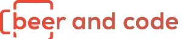

    

---

# 🛠️ Projeto Forja - Beer and Code

Este repositório será dedicado ao meu progresso no **Forja**, um treinamento intensivo da [Beer and Code](https://beerandcode.com.br/forja/) voltado para formação sólida de programadores PHP e Laravel.

> Aqui vou documentar cada etapa da minha jornada, incluindo anotações, projeto prático e reflexões sobre o aprendizado.

---

## 📁 Estrutura do Repositório (planejada)

- [`anotacoes/`](anotacoes) — Anotações e resumos de aulas e módulos.
- [`projeto/`](projeto) — Projeto desenvolvido durante o treinamento.
- [`assets/`](assets) — Imagens, logos ou materiais de apoio.

---

## 🚀 Como Usar

Por enquanto, o repositório está em construção. Em breve, será possível:

1. Acompanhar o progresso do treinamento.
2. Clonar e testar o projeto desenvolvido em Laravel e PHP.
3. Utilizar o material como fonte de estudos.

---

## 📅 Status

📌 **Início do treinamento:** Julho de 2025  
🔧 **Em andamento** — Documentação e atividades sendo adicionadas conforme avanço nos módulos.

---

## 👤 Autor

**Keven Willians Scharttz de Melo**

  
  

---

## ⚖️ Licença

Este repositório está sob a [Licença MIT](LICENSE).

